# **"When They Said"**

This is a website for people who love music, where the user can be a part of a community to learn about new music or teach others about their favourite music.


## User Experience (UX)
--------------------

### User stories

#### First Time Visitor Goals

-   As a First Time Visitor, I want to easily understand what the site is for and why I should be interested in it.

-   

-   As a First Time Visitor, I want to be able to easily navigate throughout the site to find content that relates to my interests.


-   As a First Time Visitor, I want to be excited, intrigued and feel I am in a fun and safe place with other users who share my interests.


#### Returning Visitor Goals

-   As a Returning Visitor, I want to find information on the most recent community contributions.


-   As a Returning Visitor, I want to find out how I can contribute to the community.


-   As a Returning Visitor, I want to find a way to personally connect with other community members on a platform that I am more familiar with.


#### Frequent User Goals

-   As a Frequent User, I want to contribute more and help with the growth of the community.

-   As a Frequent User, I want to check the most recent updates from community members.

-   As a Frequent User, I want to get in contact with the site owner and see how I can be more involved in the development of the community I love.

-  As a Frequent User I want to be able to access the site on all of my devices. 

## Design
_____
### Colour Scheme

-   The colour scheme used is black, white and alice blue for great contrast and readability. Imagery was used to add extra pops of colour and interest to the basic palette.


## Typography

-   The Montserrat font is the main font used throughout the whole website with Sans Serif as the fallback font, this is in case for any reason the font isn't being imported into the site correctly. Montserrat is a clean font used frequently in programming, so it is both attractive and appropriate. It is also familiar and widely used. This gives the user a feeling of familiarity and trust towards the site.

## Imagery


-The imagery used was purposely chosen, sized and positioned to convey a sense of professionalism and trustworthiness without being dry or boring. This use of imagery will promote a positive emotional response due to its fun and colourful nature.

The hover animation used for the character images which make them bounce was also used to elevate 

The animation for the character images to make them bounce is another key to provoking a positive emotional response. The act of bouncing or jumping up and down has been a response to happiness and excitement for years. This will subconsciously give the user a positive emotional response.


When the site is viewed on a mobile device the imagery for the  genre links (the characters) hover over the nav bar at the top of the screen. This was intentional and also a catch 22. Following best practice rules for ux it is unusual and untypical to have this happen


 using the z-index the character hovers over the nav bar when scrolling through the sections. This was implemented intentionally and serves a purpose, that purpose being that when the user is scrolling through that section of the page their attention is kept to that specific section. This was done to avoid any distraction and lead to a user clicking away before they found what they are looking for. It also adds a refreshing design element that may interest or excite the user.

#  Wireframes
### Home Page Wireframe


### Mobile Wireframe -

 

### genre pages and footer


### Genre page and footer mobile


### Contribute Page Wireframe


### Contribute page wireframe mobile


## Features
____
### * New Feature *
- Remain anonymous when contributing
> when testing i shared a link to some friends and colleagues one helpfull sugestion was that there should be an option to remain anonymous when submitting the form
- a check box with the value of yes-remain-anonymous was added to the form.

html
```{r}. <div class="anonymous-button">
                    <label for="anonymous-button">click here to remain anonymous</label>
                    <input type="checkbox" id="anonymous-button" name="anonymous-button" value="yes-remain-anonymous">
                </div>
```

Result

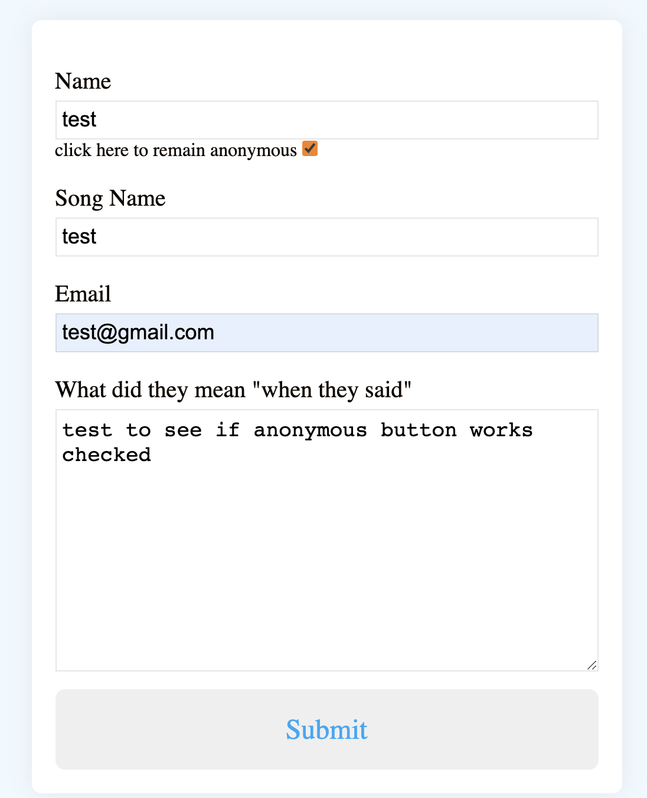

Resulting email.

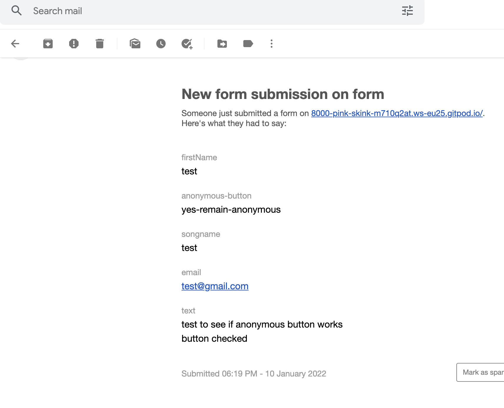


### Existing Features
1. The design of the site is fully responsive on all modern devices.
> " As a Frequent User i want to use the site on my phone while i am away from my desk."
- The site useses a combination of the Grid layout and media querys to achieve this.

Example (code for charachters to re align if screen width is less than 800px) 

html
```{r}. <div class="charachter-container">
                <div id="charachter-1">
                    <a href="hip-hop.html">
                        Click me to learn about HIPHOP</a> 
```   
css
```{r}.
 @media screen and (max-width:800px){
    .charachter-container{
        display: grid;
        gap: 1.5rem;
        grid-template-columns: 2fr 2fr;
        grid-template-rows: 1fr 1fr 1fr 1fr;
        
    }
    #charachter-1{
        grid-column: 1;
        text-align: center;
        margin-right: auto;
        margin-left: auto;
        
      }
```
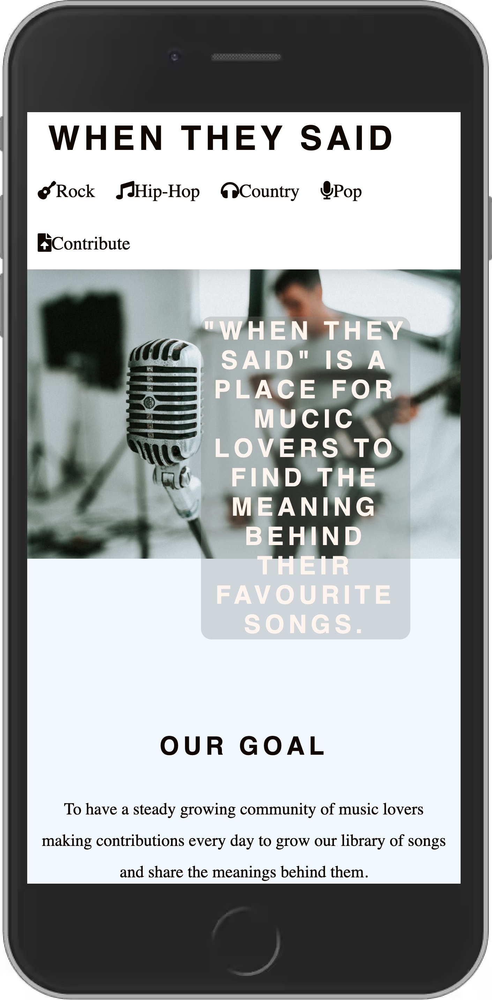

-----------

2.  The site is easy to navigate 
> " As a First Time Visitor, I want to be able to easily navigate throughout the site to find content that relates to my interests."
- The site useses a header with a fixed position so the user can always navigate to each page with ease.

Example (code for my header and nav bar.) 

html
```{r}. 
 <header>
        <a href="index.html">
            <h1 class="logo">When They Said</h1>
        </a>
    <!--nav bar--> 
                <nav class= "menu">
                    <ul>
                        <li class="genre-links"><a href="rock.html"><i class="fas fa-guitar"></i>Rock</a></li>
                    <li class="genre-links"><a href="hip-hop.html"><i class="fas fa-music"></i>Hip-Hop</a></li>
                    <li class="genre-links"><a href="country.html"><i class="fas fa-headphones"></i>Country</a></li>
                    <li class="genre-links"><a href="pop.html" ><i class="fas fa-microphone"></i>Pop</a></li>
                    <li class="genre-links"><a href="form.html"><i class="fas fa-file-upload"></i>Contribute</a></li>
                    </ul>
                </nav>
            
    </header>
```    
css       
```{r}.
 header {
    position: fixed;
    top: 0;
    width: 100%;
    background-color: white;
    z-index: 3;
    box-shadow: 0 -20px 30px #000;
}
```

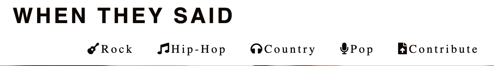

------

3. The footer element is at the bottom of each page with clearly defined social media links represented by icons.
> " As Returning Visitor, I want to find community links. And a way to personally connect with other community members on a platform that I am more familiar with."
- The site useses icons from fontawsome.com to achieve this and some css styling to make the icons match the color scheme of the site 

Example (HTML and css code for my footer) 

html
```{r}. 
<div>
        <footer>
            <ul class= "footer">
                <li>
                    <a href="http://facebook.com" target="_blank" rel="noopener" aria-label="Visit our facebook page (opens in a new tab)"> <i class="fab fa-facebook-f"></i></a>
                </li>
                <li>
                    <a href="http://twitter.com" target="_blank" rel="noopener" aria-label="Visit our twitter page (opens in a new tab)"> <i class="fab fa-twitter"></i></a>
                </li>
                <li>
                    <a href="http://instagram.com" target="_blank" rel="noopener" aria-label="Visit our instagram page (opens in a new tab)"> <i class="fab fa-instagram"></i></a>
                </li>
                <li>
                    <a href="http://youtube.com" target="_blank" rel="noopener" aria-label="Visit our youtube page (opens in a new tab)"> <i class="fab fa-youtube"></i></a>
                </li>
            </ul>
    
        </footer>
    </div>
``` 
css          
```{r}.
footer .footer{
    text-align: center;
    /*background-color: #316B83;*/
}

.footer > li{
    display: inline;
    height: 20px;
    /*background-color: #316B83;*/
    text-align: center;
   
}
footer i {
    font-size: 160%;
    margin: 1%;
    padding: 5%;
    color: lightslategray;
    /*background-color: #316B83;*/
    text-align: center;
    
}
```


------

4. The Contribute page is for users to share the meaning or story behind their favourite songs and is fully functional
> " As a Frequent User, I want to contribute more and help with the growth of the community.
- To achieve this the Contribute form is linked to formspree wich allows the site owner to recieve form data directly to their email address. This data is then converted to HTML and uploaded as content to the site. this technique of linking formspree was learned from the youtube video https://www.youtube.com/watch?v=vc9rgFHr098&t=290s

Example (code to link formspree and creating/styling the form) 

html
```{r}. 
<section>
            <div class="container">
              <form action="https://formspree.io/f/myyoyanj" method="POST" id="my-form">
          
                <div class="form-group">
                  <label for="firstName">Name</label>
                  <input type="text" id="firstName" name="firstName" required>
                </div>
          
                <div class="form-group">
                  <label for="songname">Song Name</label>
                  <input type="text" id="songname" name="songname" required>
                </div>
          
                <div class="form-group">
                  <label for="email">Email</label>
                  <input type="email" id="email" name="email" required>
                </div>
          <!--not sure if drag and drop is possible -->
                <div class="form-group">
                  <label for="text">Add your text here.</label>
                  <textarea name="text" id="text" cols="30" rows="10" required></textarea>
                </div>
          
                <button type="submit">Submit</button>
              </form>
            </div>
            <div id="status"></div>
          </section>

        </div>
    </section>
```  
css         
```{r}.
.form-group {
    width: 100%;
    margin-top: 20px;
    font-size: 20px;
  }
  .form-group input,
  .form-group textarea {
    width: 100%;
    padding: 5px;
    font-size: 18px;
    border: 1px solid rgba(128, 128, 128, 0.199);
    margin-top: 5px;
  }
  
  textarea {
    resize: vertical;
  }
  button[type="submit"] {
    width: 100%;
    border: none;
    outline: none;
    padding: 20px;
    font-size: 24px;
    border-radius: 8px;
    font-family: "Montserrat";
    color: rgb(27, 166, 247);
    text-align: center;
    cursor: pointer;
    margin-top: 10px;
    transition: 0.3s ease background-color;
  }
  button[type="submit"]:hover {
    background-color: rgb(214, 226, 236);
  }
```
html formspree
```{r}.
 <form action="https://formspree.io/f/myyoyanj" method="POST" id="my-form">
```

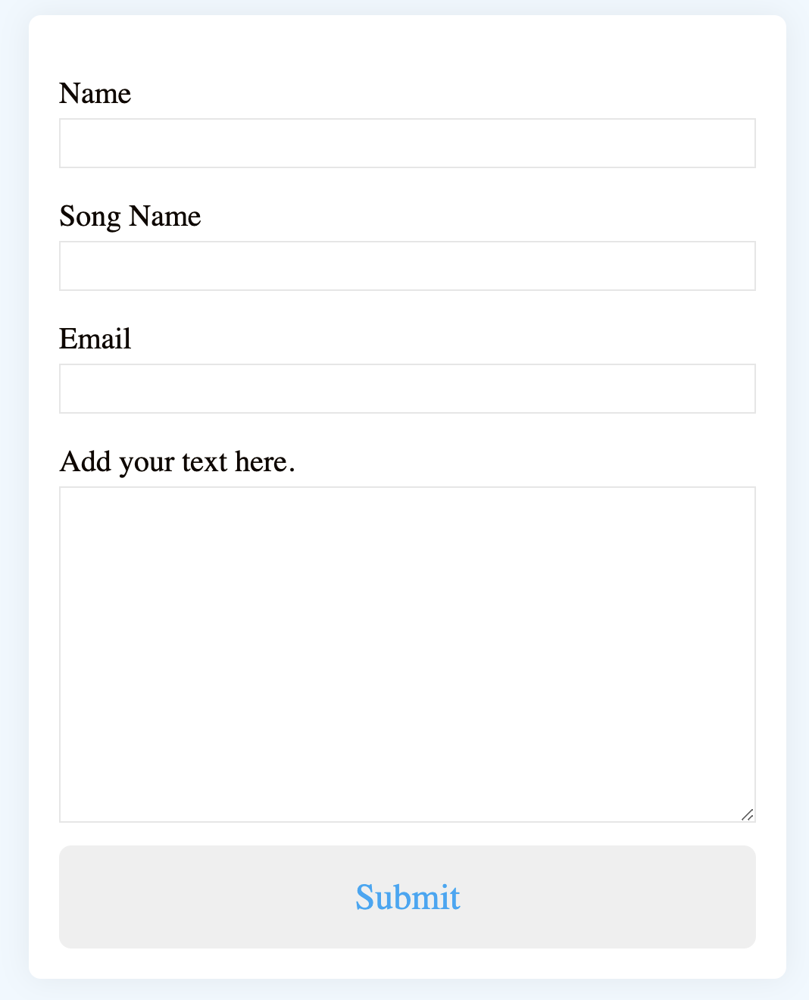

-----
## Features still to be added.
1. I would like the form data to be automaticly uploaded onto the live site

*when a user submits their favourite song and the meaning or story behind it i want that data to be uploaded to the site instantly or after an aproval phase.*

- this would require more knowledge of java script and backend frameworks.
I have looked into this and and have found someone using ggogle apps script to populate a google sheet from form data entere you can view this here. (https://support.google.com/docs/thread/48344518/solved-auto-update-auto-populate-the-form-with-realtime-data-from-sheet-after-response-is-submitted?hl=en).  
- I think another way to achieve this could be to create a fourm page and have the action of post and the url linked to a new forum submission so when a user enters data into the form it will get sent to the new submissions area on the forum page. this may not be the best way to implement such a feature but might be my only option without knowlede of java script or any backend frameworks or API's.  

2. I would like to have a hamburger menu on my nav bar for when viewing on mobile devices.  
*On some devices the links can be cluttered and lack breathing room which i think negatively impacts the asthetic of the nav bar*. 
this is possible to do with javascript and a media query and i intend to add this feature soon. i have started my research on youtube to grasp the basic concept one video i found helpful was https://www.youtube.com/watch?v=dIyVTjJAkLw&t=200s

3. I would like to add the option to create an account and store users information and allow them to post/upload directly onto the site. to achieve this i would need more backend knowledge from what i have seen in this video https://www.youtube.com/watch?v=gCo6JqGMi30 it seems like PHP and MYSQLi databases must be used also.

------
### Testing 

 the site is written with only HTML and CSS my testing will be focused on accesability,functionality and the visual asthetic.  
 1. #### Accesability
 to test the accesability of my site i carried out some manuel testing using google dev tools, amiresponsive and diffrent devices and screen sizes. one thing i was looking out for was if my media querys were performing as expected. to achieve this i used dev tools to resize each page of the site in each test the media querys functions how i expected without fault.
 2. #### Functionality
 - to test the functionality of the site i used a combination of manuel testing and markup validators. using the W3C markup validator the site had no errors or warnings to show.
 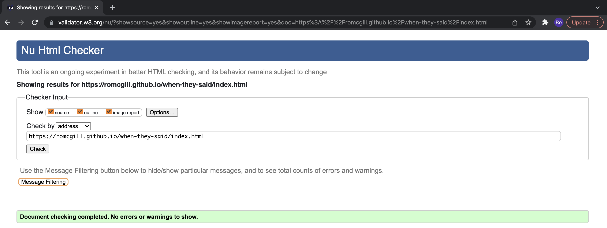
 I generated a lighthouse report on dev tools and recieved 100 on accessibility, Best practice and SEO and 78 on Performance. this issue was soon fixed by resizing my images and using tinypng.com to compress each png file to make it a smaller file size for faster load times, i also recived some advice on stack overflow to preload my hero image. using these three methods i got the performance score up to 100. due to a function google has in active development i am no longer reciving 100 in best practice, the score is now at 93.
 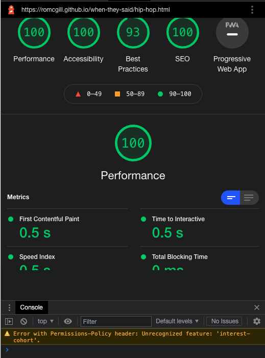
 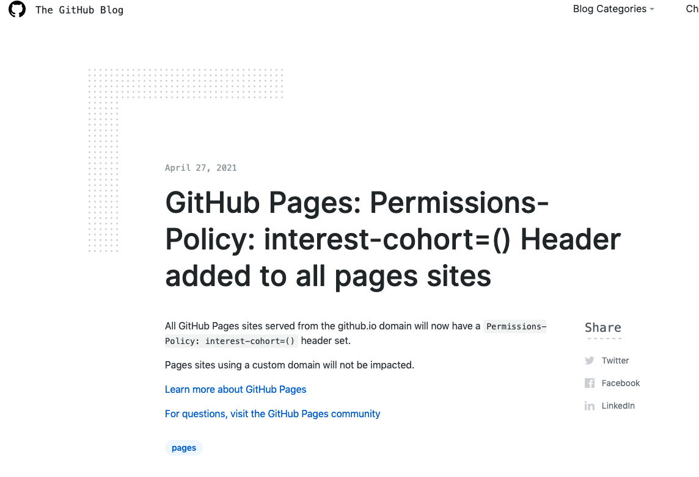
 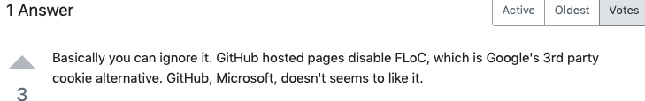
 I am confident once google fixes this bug my site will achieve 100 in every catagory.
 I used the The W3C CSS Validation Service to test my CSS code, The result came back with no errors.
 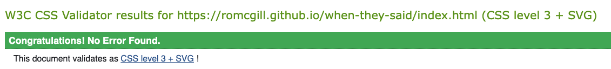
 - manual Testing. 
 tho test the site manually i ensured that all links opend the correct page and in and all pages in the nav bar lead to the correct destination. i have also made many submissions into the form to make sure that everything is functioning as it should, throughout the process of coding the website i was continuously testing every feature added and never left a feature that didnt work in the project until it was fully functional.
3. #### Visual asthetic
 - i manually chacked the colors on my site using colors.co, I did this because I felt that the contrast generators were not grate at recognising where the colours are on the page and trying to contrast two colours that are not relevant to eachother.using colors.co the cotrasr between the text and background recieved a score of 11.63 and 4 out of 5 stars.
 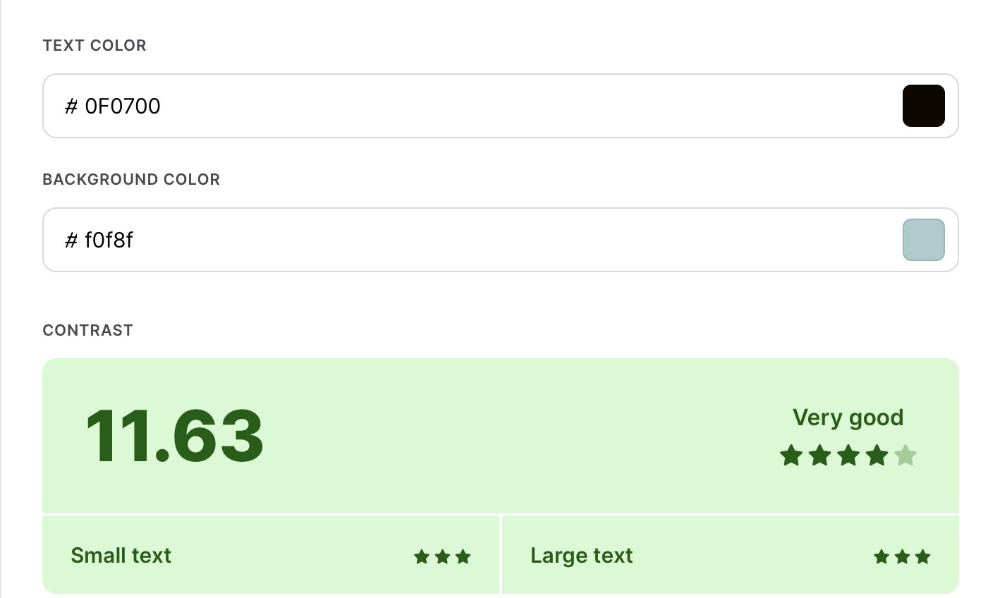

 